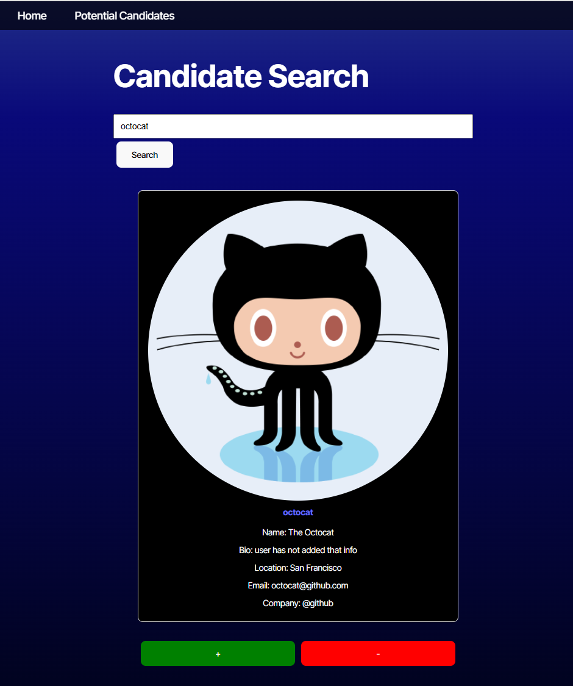
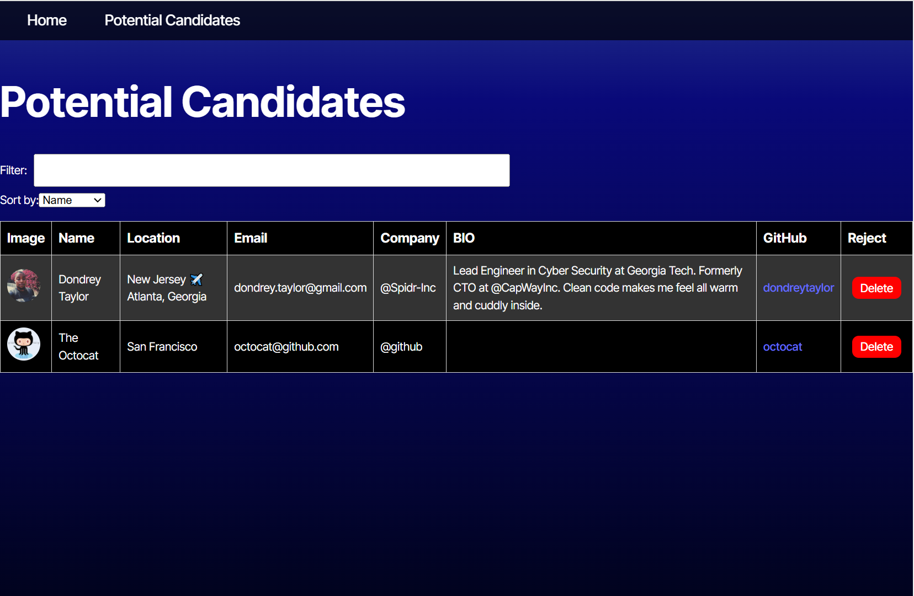

# Candidate Management App


## Description

The Candidate Management App is a web application that allows users to search for potential candidates on GitHub, save their profiles, and manage the list of saved candidates. The app provides a consistent navigation experience across all pages with a fixed navigation bar.

## Table of Contents

- [Installation](#installation)
- [Usage](#usage)
- [Deployed Site](#deployed-site) 
- [Features](#features)
- [Technologies Used](#technologies-used)
- [License](#license)
- [Contributing](#contributing)
- [Questions](#questions)

## Installation

1. Clone the repository:
   ```bash
   git clone https://github.com/your-username/candidate-management-app.git
   ```
2. Navigate to the project directory:
   ```bash
   cd candidate-management-app
   ```
3. Install the dependencies:
   ```bash
   npm install
   ```

## Usage

1. Start the development server:
   ```bash
   npm start
   ```
2. Open your browser and navigate to `http://localhost:3000`.

## Deployed Site

You can access the deployed site at [Candidate Management App](https://pink727-cs.netlify.app/).






## Features

- Search for potential candidates on GitHub.
- Save candidate profiles to local storage.
- View and manage the list of saved candidates.
- Consistent navigation bar across all pages.
- Filter candidates.
- Sort candidates by Name, Location, Email, and Company.
- Responsive design for mobile and desktop.

## Technologies Used

- React
- TypeScript
- React Router
- CSS

## License
This project is licensed under the [MIT License](https://opensource.org/license/mit).

## Contributing

Base files were provided by © 2024 edX Boot Camps


## Questions
For any questions, please contact me with the information below:

GitHub: [Pink727](https://github.com/pink727)

Email: doc72789@gmail.com

____________________________________
© 2024 Pink727. All Rights Reserved.